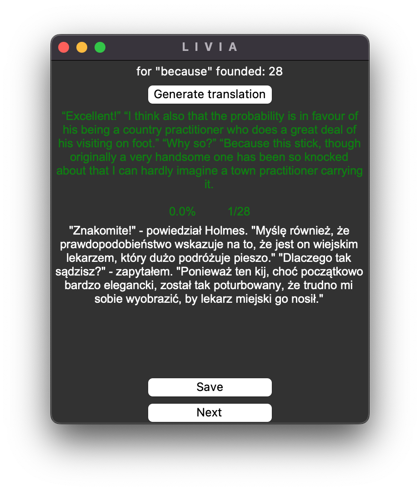

# 
L&nbsp;&nbsp;I&nbsp;&nbsp;V&nbsp;&nbsp;I&nbsp;&nbsp;A

 

## What is LIVIA?
This repository contains a GUI program designed for language learning through reading imported text files. The program 
enables users to create flashcards during reading, with automatically generated sentences and translations using the 
OpenAI.

*Currently, the program is ready for Polish speakers to learn English.

## Why?
Using the program, you can learn the language in a very practical way. By reading the text, you immediately see how 
words are used in context. Additionally, you can generate translations for words that fit the context. The program is 
most effective when used for reading books, especially those available in free plain-text versions that can be 
downloaded for free from gutenberg.org.

## How does it work?
LIVIA uses the OpenAI tool to help with translations. It shows translations in a way that makes sense for the chosen 
phrase. It translates sentences in a style that matches the writing style of the author.

## Main program window.
In the main window of the program, there is a list on the right side containing several default courses ready for 
learning. In the course "The War of the Worlds by H. G. Wells," there are over 1500 prepared flashcards. Other courses 
include either prepared books for reading or, as in the case of Norwegian language courses, only flashcards without 
texts. You can choose a course from the list for learning. At the bottom of the window, there is a label displaying 
the path of the currently opened course.

###### Buttons:
- "Create new course" - Opens a window to create a new course with an empty flashcard list.
- "Import course" - Imports a file with a course from an external source (e.g. "Anki").
- "Import text from URL" -  Opens a window to upload the content of a webpage with the text you want to connect with 
a course.
- "Add new flashcards" - Opens a window to add new flashcards.
- "Start course" - Opens a window for flashcard examination.
- "Start reading" - Opens a window for reading text and adding words to flashcards.

## Create New Course.

While creating a new course in the "Create New Course" window, it's important to ensure that the file name follows 
the pattern in English: '{book title} by {author}' (as shown in the picture). This ensures the most accurate 
generation of translations.

## Importing a File from an External Source.
When using the "Import Course" feature, it is important to note that the file won't be imported if the character 
encoding inside the file is inappropriate. The program supports the import of two types of text files: 
those from the "LIVIA" or "Anki".

## Import Text from URL.

When importing texts into courses and providing a file name, use the same name as the course you want to connect it 
with. If you wish to manually customize the text, you can edit the .txt file and keep only what you want.

## Add new flashcards.

In the "Add New Flashcards" window, you can add new words and sentences to flashcards. Please note that sentence 
translation does not work in this window; translation of words is only possible when a sentence is entered. Translations 
for regular texts are not yet available, so using this window for generating translations is not recommended, and 
sentence translation is not supported.

## Start course.

In this section, you can test your vocabulary. If the answer is correct, the words will be displayed in green. After 
each answer, a sentence (if added to flashcards) is shown. Flashcards are displayed in random order.

###### Button Descriptions:
- "Pronunciation" - Listen to the pronunciation of the word.
- "Reverse" - Reverse the flashcard.
- "Next" - Move to the next flashcard.
- "Check" - Check the answer and display the translation and sentence (if available).
- "Search sentence" - Open a window to search for sentences for the current word in the text connected to the course.
- "Easy" - Move to the next flashcard.
- "Repetitions" - Add the word to repetitions (not yet supported).
- "Play" - Listen to the pronunciation of the sentence.

*Currently, adding words to repetitions is not supported. For this reason, I recommend importing a file from 
the "LIVIA" program into the popular flashcards learning program "Anki." Flashcards files are created in a format 
compatible with "Anki" (compatibility works both ways; you can also generate a file from Anki and import it into 
the LIVIA program).

## Search Sentence.

The "Search sentence" window is used to search for sentences related to the current flashcard. Searching is available 
only when the word (question) is the word you are learning. The translation of the sentence will not be displayed in 
the window, and the option to generate a translation will be unavailable if the answer has not been previously approved. 
If the sentence that has been found is already added to the flashcards, it will be displayed in green color.

## Reading Window.

In this window, you can explore the text content for the selected course. You can navigate through the pages using 
the slider or the buttons. Each word is clickable, triggering a pop-up window for adding words to flashcards.

*To enable the translation option, you must copy your OpenAI key to 'Your_API_KEY.txt' in the config folder.

---

### Technologies:

&nbsp;&nbsp;&nbsp;
&nbsp;&nbsp;&nbsp;
&nbsp;&nbsp;&nbsp;

---
### Contact:
Created by lteresak@yahoo.com - Don't hesitate to contact me!
