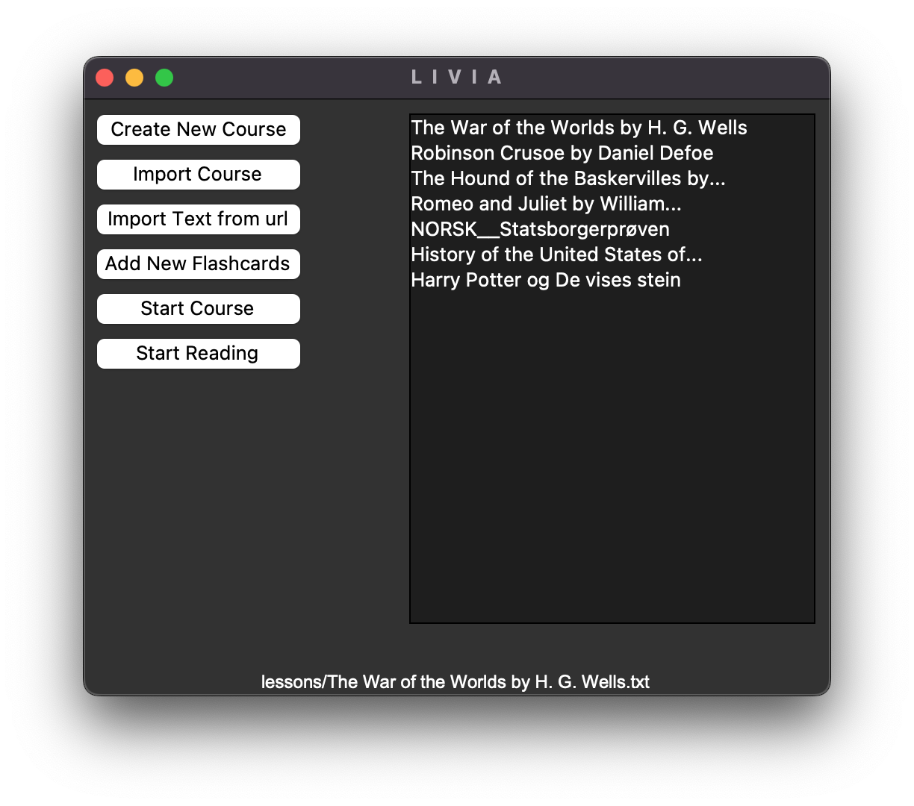

# 
L I V I A

## Co to jest LIVIA?
W tym repozytorium jest program GUI, który służy do nauki języka poprzez czytanie tekstów z zaimportowanych plików 
tekstowych. W programie jest możliwość dodawania fiszek do kursów w trakcie czytania wraz z automatycznie dodawanymi 
zdaniami i tłumaczeniami generowanymi za pomocą klucza API OpenAI.

*Program na razie służy tylko do nauki języka angielskiego dla osób mówiących w języku polskim.

## Why?
Korzystając z programu, można uczyć się języka w bardzo praktyczny sposób. Czytając tekst, widzimy od razu, w jakim 
kontekście używane są słowa, dodatkowo możemy wygenerować tłumaczenie słowa pasujące do kontekstu w zdaniu, a nawet 
w całym tekście. Program najlepiej działa podczas czytania książek, których darmowe wersje w formie czystego 
tekstu można pobrać za darmo (np. ze strony Gutenberg.org).

## How does it work?
LIVIA używa API OpenAI do generowania tłumaczeń prezentując tłumacze zgodnie z kontekstem zawartym w wybranej frazie
i tłumacząc zdania, zgodnie z kontekstem zawartym w tekście (prezentując tłumaczenie w stylu literackim pasującym 
do danego autora w przypadku tłumaczeń z książek).

## Główne okno programu.
W głównym oknie programu. W liście po prawej stronie mamy kilka domyślnych kursów przygotowanych do nauki.
W kursie "The War of the Worlds by H. G. Wells" jest przygotowanych ponad 1500 gotowych fiszek. Pozostałe kursy 
zawierają tylko przygotowane książki do czytania lub jak w przypadku kursów w języku norweskim tylko fiszki bez tekstów. 
Z listy wybieramy kurs do nauki. Na dole okna znajduje się etykieta z nazwą aktualnie otwartego kursu.

### Przyciski:
- "Create new course" - Otwiera okno do stworzenia nowego kursu z pustą listą fiszek.
- "Import course" - Importuje plik z kursem z zewnętrznego źródła (np. z programu "Anki").
- "Import text from url" - Otwiera okno do pobrania zawartości strony z tekstem, który chcemy połączyć z danym kursem.
- "Add new flashcards" - Otwiera okno do dodawania nowych fiszek spoza okna "reading".
- "Start course" - Otwiera okno do przepytywania z fiszek.
- "Start reading" - Otwiera okno do czytania tekstu i dodawania słów do fiszek.

## Okno "create new course".

W oknie "create new course" tworząc nowy kurs, należy pamiętać, żeby nazwa pliku była w języku angielskim według wzoru: 
'tytuł książki by autor' jak na zdjęciu). Wówczas generowane tłumaczenia będą najdokładniejsze.

## Importowanie pliku z zewnętrznego źródła.
Podczas importowania pliku przez użytkownika przy użyciu "Import course" należy pamiętać, że jeżeli wewnątrz pliku układ 
znaków będzie nieodpowiedni, plik nie zostanie zaimportowany. Program importuje jedynie dwa rodzaje plików tekstowych 
pochodzące z programu LIVIA lub z Anki.

## Okno "Import text from url".

W oknie do importowania tekstów do kursów podając nazwę pliku, użyj takiej samej nazwy, jaką ma kurs, z którym chcesz 
go połączyć. Jeżeli chcesz samemu dopasować tekst, możesz edytować ręcznie plik .txt i zostawić tylko to, co chcesz.

## Okno "Add new flashcards".

W oknie "Add new flashcards" dodajemy nowe słowa i zdania do fiszek. Należy pamiętać, że w tym oknie nie działa 
tłumaczenie zdań, a tłumaczenie słowa jest możliwe tylko, gdy jest wprowadzone zdanie. Tłumaczenia dla zwykłych tekstów 
nie są jeszcze dostępne, dlatego korzystanie z tego okna w celu generowania tłumaczeń nie jest zalecane, a tłumaczenie 
zdań nie jest obsługiwane.

## Okno "Start course".

W tym miejscu można sprawdzić znajomość słówek. Jeżeli odpowiedź będzie prawidłowa, słowa zostaną wyświetlone na 
zielono. Po każdej odpowiedzi jest wyświetlane zdanie (jeżeli zostało dodane do fiszek). Fiszki są wyświetlane 
w kolejności losowej.

###### Opis przycisków:
- "Pronunciation" - Odsłuchanie wymowy słowa.
- "Reverse" - Odwrócenie fiszki.
- "Next" - Przejście do następnej fiszki.
- "Check" - Sprawdzenie odpowiedzi i wyświetlenie tłumaczenia i zdania (jeżeli istnieje).
- "Search sentence" - Otwiera okno do wyszukiwania zdań dla aktualnego słowa w tekście przypisanym do danego kursu.
- "Easy" - Przejście do następnej fiszki.
- "Repetitions" - Dodaj słowo do powtórek (jeszcze nieobsługiwane).
- "Play" - Odsłuchanie wymowy zdania.

*Jeszcze nie można dodawać słów do powtórek. Z tego powodu zalecam zaimportowanie pliku z programu LIVIA do 
popularnego programu do nauki z fiszek "Anki". Pliki z fiszkami są tworzone w formie kompatybilnej z obsługą w "Anki" 
(kompatybilność działa w dwie strony, można także wygenerować plik z Anki i zaimportować go do programu LIVIA).

## Okno "Search sentence".

Okno "Search sentence" służy do wyszukiwania zdań do aktualnej fiszki. Wyszukiwanie jest dostępne tylko w przypadku 
gdy słowem (pytaniem) jest słowo, którego się uczymy. W oknie nie zostanie wyświetlone tłumaczenie zdania i możliwość 
wygenerowania tłumaczenia będzie niedostępna, jeżeli odpowiedź nie została wcześniej zatwierdzona. Jeżeli zdanie, które 
zostało znalezione i jest już dodane do fiszek, to wyświetla się ono w kolorze zielonym. 

## Okno "Reading".

W tym oknie możemy przeglądać tekst do danego kursu. Stronę można zmienić za pomocą suwaka lub za pomocą przycisków. 
Każde słowo jest interaktywne i po jego kliknięciu wywoła się wypełnione okno dodawania słówek do fiszek.

*Aby opcja tłumaczenia była aktywna, należy skopiować swój klucz OpenAI do 'Your_API_KEY.txt' w folderze config.

 

### Technologies:

&nbsp;&nbsp;&nbsp;
&nbsp;&nbsp;&nbsp;
&nbsp;&nbsp;&nbsp;
&nbsp;&nbsp;&nbsp;

 

### ToDo:
- algorytm powtórek
- baza danych mysql
- wybór języków
- installation guide
- testing

Contact
Created by lteresak@yahoo.com - Don't hesitate to contact me!
